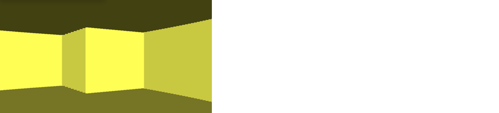
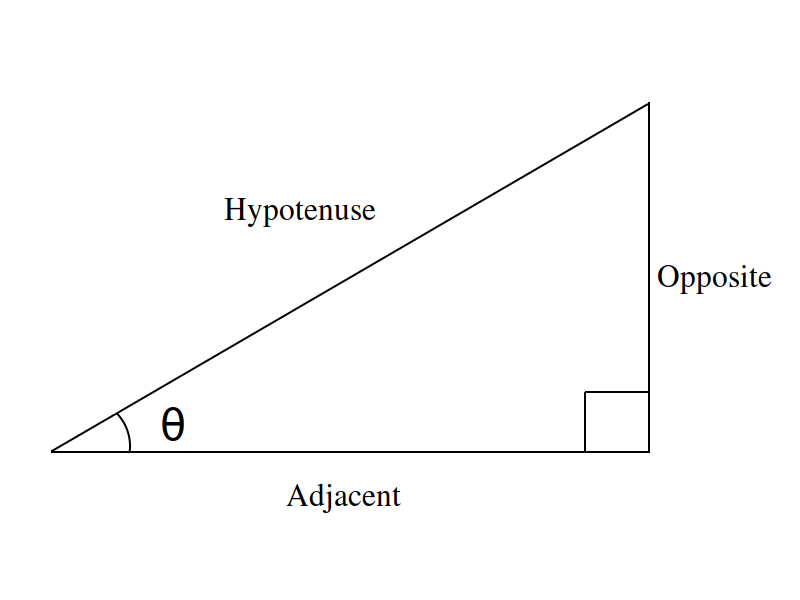
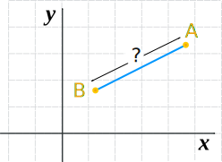
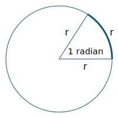
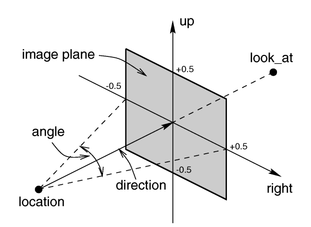

# 𝐑𝐚𝐲𝐜𝐚𝐬𝐭𝐢𝐧𝐠 𝐞𝐧𝐠𝐢𝐧𝐞 𝐟𝐨𝐫 𝐬𝐞𝐦𝐢-𝟑𝐃 𝐦𝐚𝐩

> This project is in an early stage and lacks codes and documentation. Everything is under progress, even studying the basic idea of Raycasting.

<br>

## Overview

This is a Raycasting algorithm based engine that renders a semi-3D map in realtime, creating first-person view exploration of a maze-looking space with walls. Built with JavaScript.

> The most well known game that used this technique, is Wolfenstein 3D.



<br>

## Basic idea: casting ray by ray

The height of the rectangle strip in 3D-looking canvas, and even brightness of it, depends on the ray distance. Ray distance means the length of ray between the player and the wall, calculating the distance of the ray's hit point(wall) from the player. The process goes ray by ray.

<br>

## Trigonometry used

### Sine, Cosine, Tangent

This is all about the ratio between each surface of a right-angled triangle.



Formulas are below.

```
sin(a) = opposite / hypotenuse
cos(a) = adjacent / hypotenuse
tan(a) = opposite / adjacent
```

<br>

### Pythagorean theorem - distance between two points

How to get the distance between two points A and B here?



<br>

Pythagorean theorem is the resolution.


<br>

Following code returns the the length of hypotenuse using the Pythagorean theorem.

```javascript
Math.sqrt((A.x - B.x) * (A.x - B.x) + (A.y - B.y) * (A.y - B.y));
```

<br>

### Degrees and Radian - calculating the increment of ray

Here is the concept of `radian` unit. `1 radian` stands for when the arc length is equal to the radius of a circle.



<br>

As `3.14 radian`, which is PI(`π`), stands for `180˚`, getting the function that converts a number in degree unit to radian unit is reachable.

```
radian = degree * π / 180˚
```

<br>

In coding,

```javascript
function degToRad(deg) {
	return deg * (Math.PI / 180.0);
}
```

<br>

Let's calculate the increment in radian unit. Here are assumptions.

> Why in radian unit? That is what computers understand while we, people, are familiar with angles in degrees.

- Dimension of the project plane is `320 * 200`, so 320 rays are casted.

- Think in the scope of `60˚` and just a plane wall.



<br>

```javascript
const FOV_ANGLE = 60 * (Math.PI / 180);
const NUM_RAYS = 320;

const increment = FOV_ANGLE / NUM_RAYS;
```

<br>

---

### References

- [Lode's Computer Graphics Tutorial - Raycasting](https://lodev.org/cgtutor/raycasting.html)
- [Raycasting Basics with JavaScript | Pikuma course](https://courses.pikuma.com/courses/take/raycasting/lessons/7485598-introduction-and-learning-outcomes)
